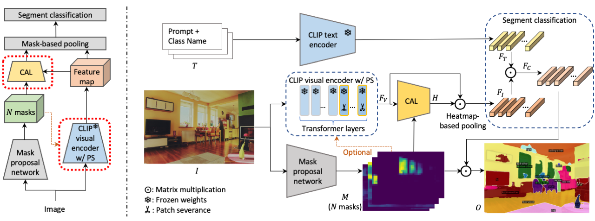
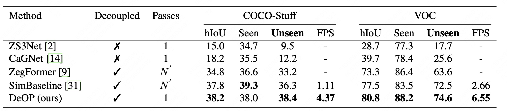

   <!-- ```
   #创建conda环境
   conda create --name deop python=3.7
   conda activate deop
   conda install pytorch==1.8.0 torchvision==0.9.0 torchaudio==0.8.0 -c pytorch

   
   conda install -c conda-forge yacs
   conda install tensorboard
   conda install pydot
   conda install iopath
   tabulate
   iopath<0.1.9 and >=0.1.7
   fvcore<0.1.4 and >=0.1.3
   timm
   wandb
   python -m pip install detectron2 -f https://dl.fbaipublicfiles.com/detectron2/wheels/cu102/torch1.8/index.html
   ``` -->

# [ICCV2023] Open Vocabulary Semantic Segmentation with Decoupled One-Pass Network

This repo is for our paper [Open Vocabulary Semantic Segmentation with Decoupled One-Pass Network](https://arxiv.org/pdf/2304.01198.pdf). It is based on the official repo of [SimBaseline](https://github.com/MendelXu/zsseg.baseline). The project page is [Project Page](https://conghan0808.github.io/DeOP/).


<!-- <iframe src="resources/framework6.pdf" width="500" height="375"></iframe> -->

### Results 
Results on COCO-Stuff and Pascal VOC in the open-vocabulary setting.
<a name="resdataset"></a>

Results on Pascal VOC, Pascal Context and ADE20K in the cross-dataset setting


## Guideline
### Setup environment
<details>
  <summary> Environment </summary>
  
  ```bash
  conda create --name deop python=3.7
  conda activate deop
  conda install pytorch==1.8.0 torchvision==0.9.0 torchaudio==0.8.0 -c pytorch
  pip install detectron2 -f https://dl.fbaipublicfiles.com/detectron2/wheels/cu102/torch1.8/index.html
  pip install mmcv==1.3.14
  
  #FurtherMore, install the modified clip package.
  cd third_party/CLIP
  python -m pip install -Ue .

  ```
</details>

### Data Preparation
<details>
  <summary> Data Preparation</summary>

  In our experiments, four datasets are used. For Cityscapes and ADE20k, follow the tutorial in [MaskFormer](https://github.com/facebookresearch/MaskFormer).
- For COCO Stuff 164k:
  - Download data from the offical dataset website and extract it like below.
     ```bash
     Datasets/
          coco/
               #http://images.cocodataset.org/zips/train2017.zip
               train2017/ 
               #http://images.cocodataset.org/zips/val2017.zip
               val2017/   
               #http://images.cocodataset.org/annotations/annotations_trainval2017.zip
               annotations/ 
               #http://calvin.inf.ed.ac.uk/wp-content/uploads/data/cocostuffdataset/stuffthingmaps_trainval2017.zip
               stuffthingmaps/ 
     ```
  - Format the data to detecttron2 style and split it into Seen (Base) subset and Unseen (Novel) subset.
     ```bash
     python datasets/prepare_coco_stuff_164k_sem_seg.py datasets/coco

     python tools/mask_cls_collect.py datasets/coco/stuffthingmaps_detectron2/train2017_base datasets/coco/stuffthingmaps_detectron2/train2017_base_label_count.pkl
     
     python tools/mask_cls_collect.py datasets/coco/stuffthingmaps_detectron2/val2017 datasets/coco/stuffthingmaps_detectron2/val2017_label_count.pkl
     ```   
- For Pascal VOC 11k:
  - Download data from the offical dataset website and extract it like below.
  ```bash
  datasets/
     VOC2012/
          #http://host.robots.ox.ac.uk/pascal/VOC/voc2012/VOCtrainval_11-May-2012.tar
          JPEGImages/
          val.txt
          #http://home.bharathh.info/pubs/codes/SBD/download.html
          SegmentationClassAug/
          #https://gist.githubusercontent.com/sun11/2dbda6b31acc7c6292d14a872d0c90b7/raw/5f5a5270089239ef2f6b65b1cc55208355b5acca/trainaug.txt
          train.txt
          
  ```
  - Format the data to detecttron2 style and split it into Seen (Base) subset and Unseen (Novel) subset.
  ```bash
  python datasets/prepare_voc_sem_seg.py datasets/VOC2012

  python tools/mask_cls_collect.py datasets/VOC2012/annotations_detectron2/train datasets/VOC2012/annotations_detectron2/train_base_label_count.json

  python tools/mask_cls_collect.py datasets/VOC2012/annotations_detectron2/val datasets/VOC2012/annotations_detectron2/val_label_count.json
  ```

</details>


### Run demo
  The demo is almost training-free, we only train the learnable text prompt. You can download the weights from [text prompt](https://drive.google.com/file/d/1b6kzLks12ONQPT6wVJsM8ZLrd_GB0br8/view?usp=drive_link) which is trained on COCO-Stuff-156 dataset.
  ```
  python3 demo.py --input dataset/test/000000000285.jpg --output ./output
  ```
  or you can add *--class-names* to set classes. 
  ```
  python3 demo.py --input dataset/test/000000000285.jpg --output ./output --class-names bear other
  ```

### Evaluation
We release the weights of DeOP in [model weight](https://drive.google.com/file/d/1TN1krQWPxbDFtpTFlEpGOf40FRByKwf4/view?usp=drive_link). The results are shown on [Results](#resdataset).
```
sh deop_verifycoco.sh
```
### Train
```
# 1.Train a learnable text prompt model.
python train_net.py --config-file configs/coco-stuff-164k-156/zero_shot_proposal_classification_learn_prompt_bs32_10k.yaml --num-gpus 8 

# 2. Train a MaskFormer model.
python train_net.py --config-file configs/coco-stuff-164k-156/zero_shot_maskformer_R101c_bs32_60k.yaml --num-gpus 8 MODEL.CLIP_ADAPTER.PROMPT_CHECKPOINT ${TRAINED_PROMPTS}
# 3. Train DeOP.
sh deop_train.sh
```

### Cite
If you find this project useful for your research, please consider citing the following BibTeX entry.
```
@proceedings{Han2023ZeroShotSS,
  title={Zero-Shot Semantic Segmentation with Decoupled One-Pass Network},
  author={Cong Han and Yujie Zhong and Dengjie Li and Kai Han and Lin Ma},
  booktitle={Proceedings of the IEEE/CVF International Conference on Computer Vision (ICCV)},
  year={2023},
}
```